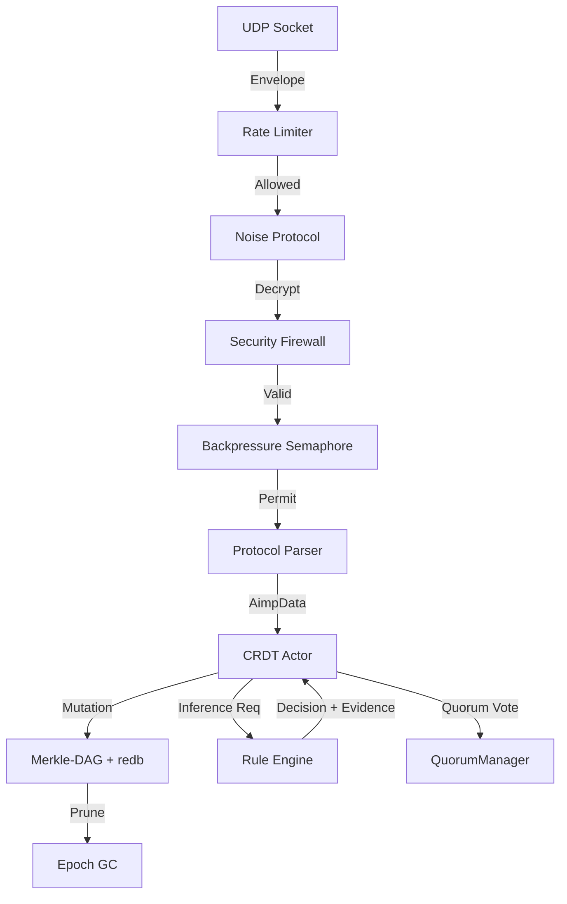

# AIMP (AI Mesh Protocol) v0.1.0

**AIMP** is an experimental, serverless networking protocol designed for resilient state synchronization between autonomous agents in fragmented, low-bandwidth networks.

Unlike traditional cloud-based protocols, AIMP operates on a **Local-First** principle, utilizing Merkle-CRDTs and cryptographic identity to ensure eventual consistency without a central authority or global DNS.

---

## Architecture

```
aimp_node/          Rust reference implementation (Cargo workspace member)
  src/
    crdt/           Merkle-DAG engine, actor model, arena allocator, quorum consensus
    crypto/         Ed25519 identity, BLAKE3 hashing, zero-trust firewall
    network/        UDP gossip, Noise Protocol XX sessions, per-peer rate limiting
    protocol/       Wire format (MessagePack), typed payload enum
    ai_bridge.rs    Pluggable deterministic inference (trait + rule engine + hot-reload)
    error.rs        Unified AimpError type hierarchy
    dashboard/      Ratatui TUI
    config.rs       Dynamic configuration with validation
    event/          Structured logging + Prometheus metrics (counters + histograms)
  tests/            Integration tests (7 tests)
  benches/          Criterion benchmarks
aimp_testbed/       Python SDK (aimp-client) + CLI tool + chaos testing
deploy/             Systemd service, Firecracker microVM, install script
formal/             TLA+ convergence + quorum safety specification
```

## Strategic Advantages

| Feature          | AIMP (Merkle-CRDT)         | Traditional (Raft/Paxos) |
| ---------------- | -------------------------- | ------------------------ |
| **Topology**     | P2P Mesh / Decentralized   | Leader / Quorum          |
| **Availability** | AP (Always Writeable)      | CP (Requires Majority)   |
| **Ordering**     | Causal (Vector Clocks)     | Total (Sequential)       |
| **Integrity**    | Cryptographic (Merkle-DAG) | Log-based                |
| **Hardware**     | Edge/IoT Optimized         | Data Center Grade        |

## Key Features (v0.1.0)

**Core Engine**
- Actor Model with zero-shared-state CRDT via `tokio::mpsc`
- Slab/Arena allocation with O(1) insertion and SoA layout
- Durable persistence via redb with ChaCha20Poly1305 encryption at rest
- HKDF-SHA256 key derivation with domain separation
- Cached merkle root with invalidation-on-write
- Real mark-and-sweep GC with slab memory reclamation
- Epoch-based GC tracking integrated into the CRDT actor

**Networking & Security**
- Noise Protocol XX encrypted sessions (default on)
- Per-peer token bucket rate limiting (integer arithmetic)
- O(1) gossip deduplication via HashSet + VecDeque
- TTL replay attack detection with circuit breaker
- Session LRU eviction (TTL + max count)
- Protocol version range negotiation for rolling upgrades

**AI & Consensus**
- Pluggable `InferenceEngine` trait with `RuleEngine` implementation
- Hot-reload rules from `aimp_rules.json` (no restart needed)
- BFT quorum voting with persistent verified decisions
- Typed `Payload` enum per opcode (compile-time safety)

**Observability**
- Prometheus counters, gauges, and latency histograms
- Composite `/health` endpoint with sub-checks and HTTP status codes
- Structured `SystemEvent` logging with TUI dashboard

**Operations**
- Unified `AimpError` type hierarchy (no more `Box<dyn Error>`)
- Config validation (rejects invalid parameter combinations)
- Graceful shutdown with 5-second timeout
- Systemd hardened service file
- CI/CD: lint, test, security audit, docs, cross-compiled releases

## Edge Deployment

AIMP is designed to run as a **single static binary** with zero runtime dependencies. No Docker, no container runtime, no JVM.

### Quick Deploy (bare metal)

```bash
# Download the binary for your architecture
curl -LO https://github.com/fabriziosalmi/aix/releases/latest/download/aimp_node-aarch64-linux
chmod +x aimp_node-aarch64-linux

# Install as systemd service
sudo deploy/install.sh ./aimp_node-aarch64-linux

# Start
sudo systemctl start aimp-node
curl localhost:9090/health
```

### Cross-Compile from Source

```bash
make install-cross-targets   # One-time: install musl targets
make edge-arm64              # ARM64 (RPi 4/5, Jetson, Graviton)
make edge-armv7              # ARMv7 (RPi 2/3, industrial PLCs)
make edge-x86                # x86_64 (edge gateways)
make edge-all                # All three
```

### Firecracker MicroVM (multi-tenant isolation)

For edge gateways running multiple untrusted workloads:

```bash
sudo make microvm-rootfs     # Builds ~15MB Alpine rootfs with AIMP
firecracker --no-api --config-file deploy/firecracker/vm-config.json
```
Boot time: ~125ms. Memory: 64MB. vCPU: 1.

### Systemd Service

The included service file (`deploy/systemd/aimp-node.service`) provides:

| Hardening | Value |
|-----------|-------|
| User isolation | Dedicated `aimp` user, no login shell |
| Filesystem | `ProtectSystem=strict`, `ProtectHome=yes` |
| Memory limit | `MemoryMax=128M` |
| CPU limit | `CPUQuota=80%` |
| Privilege | `NoNewPrivileges=yes`, `MemoryDenyWriteExecute=yes` |
| Syscall filter | `@system-service` whitelist |
| Restart | On failure with exponential backoff |
| Shutdown | SIGTERM → 10s grace → SIGKILL |

### Release Automation

Tag a version to trigger automated cross-compilation and GitHub Release:

```bash
git tag v0.5.0
git push --tags
```

GitHub Actions builds static binaries for x86_64, ARM64, and ARMv7 and attaches them to the release.

## Use Cases

### Industrial & Infrastructure

- **Oil & Gas Pipeline Monitoring** — Pressure and flow sensors deployed across hundreds of kilometers of pipeline share readings via AIMP mesh. When a sensor detects an anomaly, the rule engine flags it as critical and the quorum mechanism ensures multiple independent nodes confirm the reading before triggering a valve shutdown — preventing both false positives and missed leaks in areas with no cellular coverage.

- **Power Grid Edge Coordination** — Solar inverters, battery controllers, and smart meters in a microgrid synchronize load-balancing decisions without a central SCADA server. During a grid islanding event (storm, outage), nodes continue coordinating locally and merge state seamlessly when connectivity is restored.

- **Water Treatment Plant Automation** — Distributed PLCs monitoring chlorine levels, turbidity, and pH across treatment stages publish authenticated readings. The BFT quorum ensures that a dosing adjustment is only applied when multiple sensors agree, preventing contamination from a single faulty sensor.

### Autonomous Systems & Robotics

- **Warehouse Robot Fleet** — AGVs (Automated Guided Vehicles) operating in a fulfillment center share occupancy maps and task assignments via local mesh. When WiFi access points go down during peak load, robots continue coordinating through direct UDP gossip, merging their state when infrastructure recovers.

- **Agricultural Drone Swarms** — Crop-spraying drones operating over large fields without continuous ground station contact share coverage maps and obstacle data. Each drone's decisions (skip area, re-spray, return-to-base) are logged as auditable AI evidence for regulatory compliance.

- **Underground Mining Vehicles** — Autonomous haulers in a mine share tunnel occupancy and ventilation sensor data. AIMP's partition tolerance ensures coordination continues through rock falls or radio dead zones, with cryptographic non-repudiation for safety audit trails.

### Defense & Disaster Response

- **Tactical Mesh Networks** — Forward-deployed sensor nodes (acoustic, seismic, thermal) share detections across a mesh that operates without DNS, central servers, or stable backhaul. Zero-trust verification prevents adversarial injection of false readings.

- **Disaster Response Coordination** — First responder teams deploy portable AIMP nodes to share building assessments, casualty triage data, and resource allocation in areas where cellular infrastructure is destroyed. Data merges automatically as teams move in and out of radio range.

- **Maritime Vessel Coordination** — Ships in a convoy synchronize navigation waypoints, weather observations, and cargo status via HF radio mesh. AIMP's low-bandwidth MessagePack protocol and delta-sync minimize transmission time on congested frequencies.

### Environmental & Scientific

- **Wildfire Sensor Networks** — Weather stations and smoke detectors deployed across remote forest land share readings. When multiple nodes detect rising temperature + dropping humidity + smoke particles, the quorum-verified decision triggers evacuation alerts — even if half the sensors are offline due to fire damage.

- **Seismic Monitoring Arrays** — Distributed seismographs in volcanic regions share waveform hashes and event classifications. The Merkle-DAG provides a tamper-proof, chronologically ordered record of all detections for post-event forensic analysis.

- **Ocean Buoy Networks** — Oceanographic buoys measuring wave height, temperature, and salinity synchronize data via satellite mesh with extreme latency and packet loss. AIMP's CRDT convergence guarantees eventual consistency regardless of message ordering or duplication.

### Smart Infrastructure & IoT

- **Building Management Systems** — HVAC controllers, occupancy sensors, and energy meters across a campus coordinate without a cloud dependency. If the building management server goes offline, local zones continue optimizing independently and reconcile when connectivity returns.

- **Traffic Signal Coordination** — Intersection controllers share real-time traffic flow data via local mesh. During a central system failure, intersections fall back to peer-coordinated adaptive timing rather than fixed-cycle failsafe mode.

- **Cold Chain Logistics** — Temperature sensors in refrigerated containers share readings across a shipment fleet. The encrypted persistence layer (redb + ChaCha20Poly1305) ensures that the full temperature history is tamper-proof for regulatory compliance, even if a container's gateway device is physically compromised.

## Data Flow



---

## Quick Start

### 1. Run the Node
```bash
cargo run -- --port 1337 --name node1
```

### 2. Python CLI
```bash
cd aimp_testbed
pip install -e .
aimp-cli health --target 127.0.0.1 --metrics-port 9090
aimp-cli infer "Check valve pressure in sector north"
```

### 3. Run Tests & Benchmarks
```bash
make test                     # Property-based + integration tests
make bench                    # Criterion benchmarks
make lint                     # Format + clippy
make docs                     # Generate rustdoc
```

## Configuration

Configuration is loaded from (highest priority first):

1. **CLI arguments** (`--port`, `--name`)
2. **Environment variables** (`AIMP_PORT`, `AIMP_NOISE_REQUIRED`, `AIMP_PEER_RATE_LIMIT`, ...)
3. **`aimp.toml`** file (optional)
4. **Hardcoded defaults**

| Parameter | Default | Description |
|-----------|---------|-------------|
| `port` | 1337 | UDP listen port |
| `metrics_port` | 9090 | Prometheus HTTP port |
| `noise_required` | true | Enforce Noise Protocol encryption |
| `peer_rate_limit` | 50 | Max messages/sec per peer |
| `peer_rate_burst` | 100 | Token bucket burst capacity |
| `gc_mutation_threshold` | 1000 | Mutations before GC sweep |
| `quorum_threshold` | 2 | Nodes required for BFT consensus |
| `dag_history_depth` | 100 | Max DAG depth retained after GC |

## License

MIT License.
