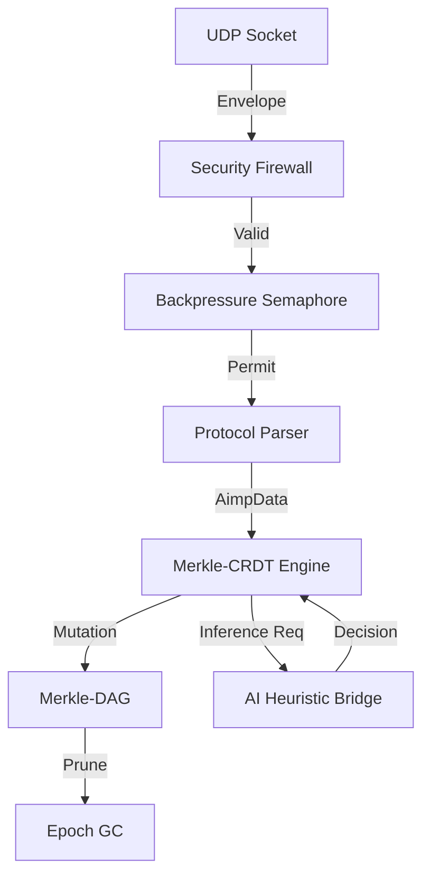

# AIMP (AI Mesh Protocol) v0.3.0-alpha

**AIMP** is an experimental, serverless networking protocol designed for resilient state synchronization between autonomous agents in fragmented, low-bandwidth networks.

Unlike traditional cloud-based protocols, AIMP operates on a **Local-First** principle, utilizing Merkle-CRDTs and cryptographic identity to ensure eventual consistency without a central authority or global DNS.

---

## The implementation is divided into two main environments: `aimp_node` (Rust Daemon) and `aimp_testbed` (Python Control).

## Strategic Advantages

AIMP is engineered for environments where 100% uptime and centralized authorities are not guaranteed.

| Feature          | AIMP (Merkle-CRDT)         | Traditional (Raft/Paxos) |
| ---------------- | -------------------------- | ------------------------ |
| **Topology**     | P2P Mesh / Decentralized   | Leader / Quorum          |
| **Availability** | AP (Always Writeable)      | CP (Requires Majority)   |
| **Ordering**     | Causal (Vector Clocks)     | Total (Sequential)       |
| **Integrity**    | Cryptographic (Merkle-DAG) | Log-based                |
| **Hardware**     | Edge/IoT Optimized         | Data Center Grade        |

## Real-World Use Cases

- **Decentralized Fleet Orchestration**: Autonomous edge nodes (sensors, solar controllers) coordinating in isolated or low-connectivity zones without a primary controller.
- **Zero-Trust Sensor Networks**: Industrial IoT sensors publishing authenticated readings that are cryptographically verified by all peers before triggering local AI logic.
- **Edge AI Decision Logging**: Synchronizing deterministic AI inference results across multiple edge nodes to ensure a single, auditable source of truth for "why" a system acted.
- **Resilient Mesh Communications**: Secure, metadata-invisible state-sync for remote infrastructure operations requiring high-frequency updates and extreme partition tolerance.

## Possible Demos & Validations

1. **Chaos Convergence**: Run 5 nodes, disconnect 2 nodes, perform 10 mutations on each "island," and reconnect. Observe the Merkle Roots converge instantly via Delta-Sync.
2. **Signature Poisoning**: Use the `chaos_client.py` to send 5 packets with invalid Ed25519 signatures. Observe the Circuit Breaker blocking the malicious peer IP in real-time.
3. **Epoch GC Pruning**: Monitor memory usage as mutations scale to 1000+. Observe the persistent footprint as historical DAG nodes are pruned while maintaining frontier integrity.



---

## Project Components

---

## Technical Implementation

### Merkle-CRDT Synchronization
Every mutation is encapsulated in a `DagNode`. The hash is calculated as:
`H = BLAKE3(Parents || Signature || DataHash || VectorClock)`
Nodes utilize **Delta-Sync** to exchange only missing fragments of the DAG, minimizing bandwidth.

### Epoch Garbage Collection
To support long-running sessions on edge hardware, AIMP implements a sweep-and-prune GC:
- **Cycle**: Every 10 mutations.
- **Persistence**: Retains the current frontier and its immediate 2-level history.
- **Integrity**: Pruning does not affect the `Global Root` hash consistency.

---

## Quick Start

### 1. Run the Node
```bash
cd aimp_node
cargo run
```
*Port 7777 UDP. The dashboard will initialize automatically.*

### 2. Run the Testbed
```bash
cd aimp_testbed
python3 chaos_client.py
```
*Validates the full cryptographic pipeline: Identity -> Signing -> Broadcast -> Verification -> Merkle Commit.*

## License
MIT License.
